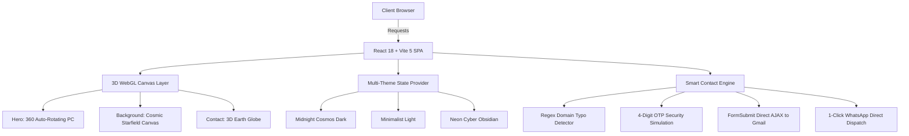

<div align="center">

# 🌌 Vinayak Subhash Deshmane
### 🚀 AI & Data Science Engineer • Full Stack Web Architect • Android Developer

[](https://vina-yak711.github.io/porffolio/)
[](https://vina-yak711.github.io/porffolio/resume.html)
[](https://wa.me/917249868441)
[](mailto:vinuu02052005@gmail.com)

```
⚡ "Learn • Build • Innovate • Inspire • Repeat"
```

</div>

---

## 📸 Visual Demos & Previews

<div align="center">

### 🪐 3D Interactive Desktop Model & Space Canvas
*Continuous 360° Auto-Rotating Three.js WebGL Canvas with OrbitControls*


---

### 📄 Dedicated Printable Resume Engine
*One-Click Print / PDF Exportable Clean Resume System*


</div>

---

## 👨‍💻 About Me

I am a technology-driven **Computer Engineering graduate** and currently a **3rd-year Artificial Intelligence & Data Science undergraduate** at **Siddhivinayak Technical Campus, Shegaon**.

My passion lies at the intersection of **Interactive 3D Web Graphics, Scalable Full-Stack Engineering, Android Application Architecture, and Intelligent AI Systems**. I believe that engineering is not just about writing syntax—it is about architecting seamless digital experiences that solve real-world challenges.

* 🎓 **B.Tech (Pursuing):** Artificial Intelligence & Data Science, *Siddhivinayak Technical Campus, Shegaon*
* 🏛️ **Diploma in Computer Engineering:** *Government Polytechnic, Hingoli* (**75.80% Aggregate, 2025**)
* 🏫 **SSC (10th):** *Manik Memorial Aryan School, Hingoli* (**75.00%, 2021**)
* 📍 **Location:** Maharashtra, India
* 💼 **Open To:** AI/ML Internships, Full Stack Web Roles, Software Engineering Opportunities

---

## 🛠️ Comprehensive Technical Skillset

<div align="center">

### 💻 Programming Languages


### 🌐 Web & 3D Frontend Engineering


### 🤖 AI, Machine Learning & Backend


</div>

---

## 🏛️ System Architecture & Engineering Highlights



### 1. 🪐 3D WebGL Rendering Pipeline
* **Continuous 360° Auto-Rotation:** Integrated Three.js `OrbitControls` with `autoRotate={true}` and `autoRotateSpeed={2.2}`, allowing dynamic user interaction while maintaining an organic continuous spin.
* **Low-Latency Shader Atmosphere:** Ambient hemisphere, directional spotlighting, and particle starfields rendered at 60 FPS across desktop and mobile.

### 2. 🛡️ Intelligent Contact & Security Verification System
* **Smart Typo Auto-Correct:** Real-time domain validation that catches accidental misspellings (`@gamil.com`, `@yaho.com`, `@hotmial.com`) with instant 1-click correction.
* **OTP Security Check:** Simulates four-digit cryptographic verification with a 60-second countdown timer.
* **Dual Delivery Workflow:** Dispatches full payload directly to `vinuu02052005@gmail.com` while preparing an instant copy for Vinayak's WhatsApp (`+91 7249868441`).

### 3. 📸 Dual Instagram Profile Integration
* Glassmorphic popup modal providing verified links to both:
  * 📸 **Personal Account:** [@vina_yak711](https://www.instagram.com/vina_yak711/)
  * 💻 **Developer & Tech Account:** [@viinayak.in](https://www.instagram.com/viinayak.in/)

---

## 🏢 Industrial Training & Hackathon Experience

| Organization / Event | Role / Domain | Key Focus & Deliverables |
|---|---|---|
| **UEF EdTech Pvt. Ltd. (UR Engineering Friend)** | Android Developer Intern *(6 Weeks)* | Activity Lifecycle, Android SDK, REST API Parsing, SQLite Integration & UI Architecture. |
| **Ajay Cables & Broadband Service OPC Pvt. Ltd.** | Network Engineering Intern *(6 Weeks)* | Optical Fiber Networking, Topology Setup, Server Maintenance, Network Security & Hardware Diagnostics. |
| **ArtPark CodeForge Hackathon (IISc Bangalore & Unstop)** | Team Prototype Developer | High-intensity prototyping, algorithmic problem solving & system design. |
| **State Technical Festivals** | Project Presenter & Innovator | Presented **AI-Based IoT Health Monitoring System** combining sensors with Machine Learning models. |

---

## 💻 Featured Projects Built

1. **🏥 AI-Based IoT Health Monitoring System:** Integrated embedded health telemetry sensors with intelligent predictive ML models for real-time anomaly detection.
2. **🌐 Advanced 3D Interactive Portfolio:** High-performance Three.js WebGL application featuring 3 themes, 360° 3D models, and smart contact workflows.
3. **🏨 Hotel Management System:** Desktop/Web management suite for booking lifecycles, billing, and customer room inventory management.
4. **🏢 Student Hostel Entry & Exit Management System:** Automated digital logging portal for campus hostel security and student attendance verification.
5. **🔍 Advanced IP Address & Network Inspector:** Network diagnostic utility analyzing IPv4/IPv6 headers, geolocations, and socket routes.
6. **📄 Dynamic Web Resume Builder:** Customizable resume generator outputting ATS-compliant resumes with instant PDF export.
7. **⚡ Typing Speed & Accuracy Engine:** Real-time WPM calculation platform featuring error detection algorithms.
8. **📱 Native Android Application Suite:** Production-ready mobile applications built with Kotlin and Java.

---

## 📊 GitHub Analytics & Real-Time Activity

<div align="center">

<a href="https://github.com/vina-yak711">
  
</a>

<br/><br/>

<a href="https://github.com/vina-yak711">
  
</a>

</div>

---

## 🚀 Quick Setup & Installation

```bash
# 1. Clone the repository
git clone https://github.com/vina-yak711/porffolio.git

# 2. Change into the project directory
cd porffolio

# 3. Install NPM dependencies
npm install

# 4. Start local development server
npm run dev
```

### ⚡ Build & Localhost Sync Commands
```bash
# Build production bundle
npm run build

# 1-Click build and sync to local XAMPP Apache server (C:\xampp\htdocs\portfolio)
npm run sync:local
```

---

## 📜 MIT License

This project is licensed under the **[MIT License](LICENSE)**.  
Copyright (c) 2026 **Vinayak Subhash Deshmane**.

```
Permission is hereby granted, free of charge, to any person obtaining a copy
of this software and associated documentation files (the "Software"), to deal
in the Software without restriction, including without limitation the rights
to use, copy, modify, merge, publish, distribute, sublicense, and/or sell
copies of the Software...
```

---

<div align="center">

**Crafted with 💜 by Vinayak Subhash Deshmane**  
*AI & Data Science Student • Full Stack & Android Developer*

[](https://github.com/vina-yak711)
[](https://github.com/vina-yak711)
[](https://www.instagram.com/vina_yak711/)
[](https://wa.me/917249868441)

</div>
