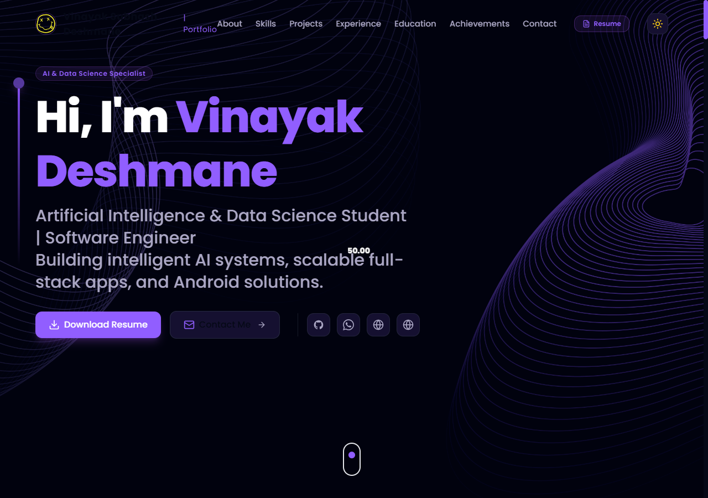
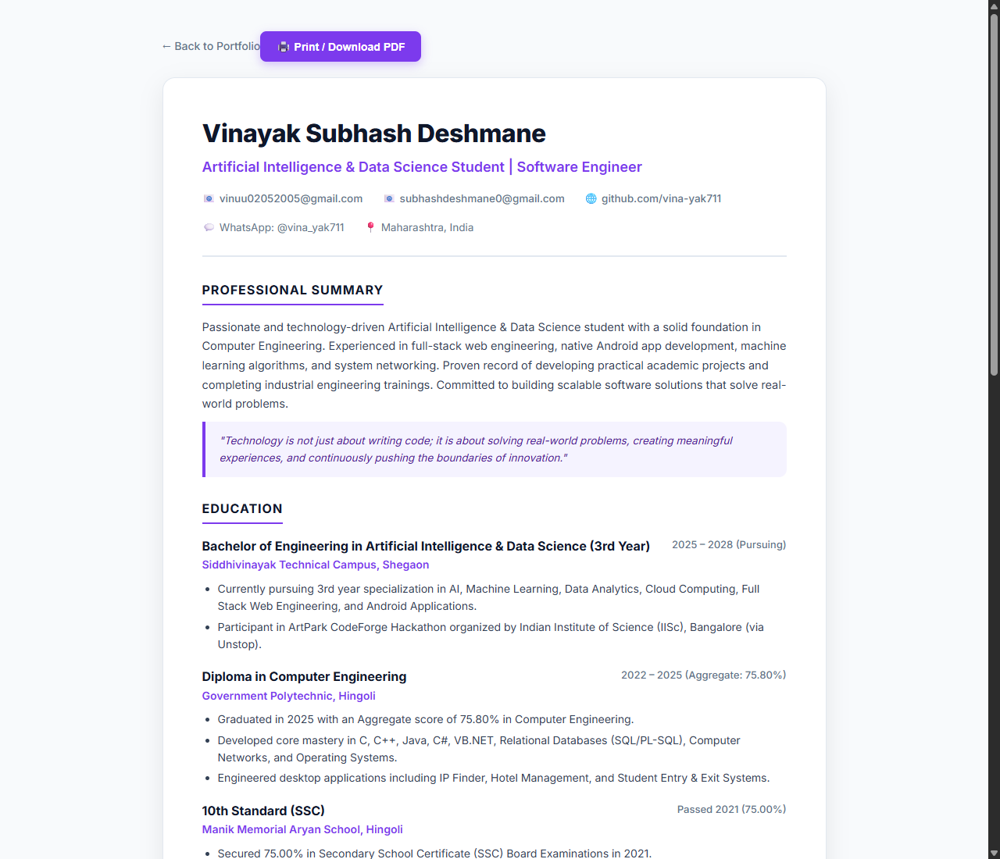

# 🚀 Vinayak Subhash Deshmane - 3D Interactive Portfolio & Resume

<div align="center">


**An immersive, high-performance 3D Web Portfolio engineered with React 18, Three.js, TypeScript, and Tailwind CSS.**

[🌐 View Live Portfolio](https://vina-yak711.github.io/porffolio/) • [📄 Printable Resume](https://vina-yak711.github.io/porffolio/resume.html) • [💬 WhatsApp Direct](https://wa.me/917249868441) • [📧 Email Me](mailto:vinuu02052005@gmail.com)

</div>

---

## 📸 Screenshots & Visual Previews

### 🪐 1. 3D Hero Section & Continuous Auto-Rotating PC Model


### 📄 2. Dedicated Printable HTML & PDF Resume


---

## 👤 About Developer

* **Developer:** Vinayak Subhash Deshmane
* **Primary Role:** AI & Data Science Engineer / Full Stack Web Developer / Android Developer
* **Academic Background:**
  * **B.Tech (3rd Year, Pursuing):** Artificial Intelligence & Data Science at **Siddhivinayak Technical Campus, Shegaon**
  * **Diploma in Computer Engineering:** **Government Polytechnic, Hingoli** (*75.80% Aggregate, 2025*)
  * **10th SSC:** Manik Memorial Aryan School, Hingoli (*75.00%, 2021*)
* **Motto:** `Learn • Build • Innovate • Inspire • Repeat`
* **Direct Contacts:**
  * 📧 Primary Email: `vinuu02052005@gmail.com`
  * 💬 WhatsApp / Mobile: `+91 7249868441`
  * 📍 Location: Maharashtra, India
* **Instagram Profiles:**
  * 📸 Personal Profile: [@vina_yak711](https://www.instagram.com/vina_yak711/)
  * 💻 Developer / Tech Profile: [@viinayak.in](https://www.instagram.com/viinayak.in/)
* **GitHub:** [github.com/vina-yak711](https://github.com/vina-yak711)

---

## ✨ Key Features & Technical Highlights

### 🪐 1. Advanced 3D Graphics (Three.js & React Three Fiber)
* **Continuous 360° Auto-Rotating 3D Desktop PC:** Interactive 3D PC model in the Hero section with smooth continuous auto-rotation (`autoRotateSpeed={2.2}`) and full OrbitControls for 3D exploration.
* **Cosmic Midnight Space Background:** Deep starry canvas (`#050816`) with floating 3D particle stars (`StarsCanvas`).
* **3D Earth Globe Model:** High-detail 3D Earth planet in the Contact section with continuous rotation.
* **Floating 3D Tech Spheres:** Interactive Three.js spheres displaying core programming technologies.

### 📸 2. Dual Instagram Account Modal
* Glassmorphic modal popup triggered on clicking the Instagram badge.
* Provides direct one-click access to both **Personal (`@vina_yak711`)** and **Tech / Developer (`@viinayak.in`)** accounts.

### 🛡️ 3. Smart Contact Form & Dual Message Delivery
* **Privacy-First Action Badges:** Clean badges (`✉️ Email`, `💬 WhatsApp`) without exposing raw mobile numbers or plain-text email strings.
* **Smart Domain Typo Detector:** Detects misspelled email domains (such as `@gamil.com`, `@yaho.com`, `@hotmial.com`) and offers a 1-click **"Fix Typo"** button.
* **4-Digit Email Security OTP Verification:** Interactive email verification code with a 60-second timer and a green **"✅ Verified"** authentic sender badge.
* **Dual Message Dispatch (Gmail + WhatsApp):**
  1. **Direct Gmail Inbox Delivery:** Full lead submission via FormSubmit AJAX endpoint to `vinuu02052005@gmail.com`.
  2. **Instant 1-Click WhatsApp Forwarding:** Pre-formatted inquiry summary generated directly to Vinayak's WhatsApp (`+91 7249868441`).

### 🎨 4. Multi-Theme Engine & High-Contrast Readability
* **Theme Modes:**
  * 🌙 **Dark Mode (Default):** Deep Midnight Cosmos (`#050816`) with radiant purple accents (`#915EFF`).
  * ☀️ **Light Mode:** Clean minimalist slate with deep navy typography (`#0f172a`).
  * ⚡ **Cyber Mode:** High-tech obsidian with neon cyan highlights (`#06B6D4`).
* **Enhanced Contrast:** High-contrast text tokens (`#ffffff` in Dark mode) ensure crystal-clear visibility across all inputs, textareas, cards, and labels.

---

## 🛠️ Complete Tech Stack

| Category | Technologies |
|---|---|
| **Core Framework** | React 18, TypeScript, Vite 5 |
| **3D Rendering** | Three.js, React Three Fiber (`@react-three/fiber`), React Three Drei (`@react-three/drei`) |
| **Animation & UI** | Framer Motion, Tilt Parallax (`react-parallax-tilt`), Lucide React Icons |
| **Styling** | Tailwind CSS, PostCSS, Custom CSS Variables |
| **Form Backend** | FormSubmit AJAX API, WhatsApp Click-to-Chat API |

---

## 💻 Local Setup & Installation

```bash
# 1. Clone the repository
git clone https://github.com/vina-yak711/porffolio.git

# 2. Navigate to project root
cd porffolio

# 3. Install dependencies
npm install

# 4. Start local development server
npm run dev
```

Visit `http://localhost:5173/` in your browser.

---

## ⚡ Build & Localhost Sync Commands

```bash
# Build optimized production bundle
npm run build

# 1-Click Build & Sync to Local XAMPP Apache server (C:\xampp\htdocs\portfolio)
npm run sync:local
```

---

## 📜 MIT License

This project is open-source and licensed under the **[MIT License](LICENSE)**.

```text
MIT License

Copyright (c) 2026 Vinayak Subhash Deshmane

Permission is hereby granted, free of charge, to any person obtaining a copy
of this software and associated documentation files (the "Software"), to deal
in the Software without restriction, including without limitation the rights
to use, copy, modify, merge, publish, distribute, sublicense, and/or sell
copies of the Software, and to permit persons to whom the Software is
furnished to do so, subject to the following conditions:

The above copyright notice and this permission notice shall be included in all
copies or substantial portions of the Software.

THE SOFTWARE IS PROVIDED "AS IS", WITHOUT WARRANTY OF ANY KIND, EXPRESS OR
IMPLIED, INCLUDING BUT NOT LIMITED TO THE WARRANTIES OF MERCHANTABILITY,
FITNESS FOR A PARTICULAR PURPOSE AND NONINFRINGEMENT. IN NO EVENT SHALL THE
AUTHORS OR COPYRIGHT HOLDERS BE LIABLE FOR ANY CLAIM, DAMAGES OR OTHER
LIABILITY, WHETHER IN AN ACTION OF CONTRACT, TORT OR OTHERWISE, ARISING FROM,
OUT OF OR IN CONNECTION WITH THE SOFTWARE OR THE USE OR OTHER DEALINGS IN THE
SOFTWARE.
```

### 🔹 What the MIT License Means:
* **✅ Free for Educational & Personal Use:** Developers and students can study the codebase, inspect the Three.js 3D pipelines, and learn modern React architecture.
* **✅ Commercial & Modification Rights:** Allows adaptation and reuse under permissive open-source standards.
* **✅ Copyright Protection:** Ensures that the original author credit (**Vinayak Subhash Deshmane**) is preserved in all distributions.
* **✅ As-Is Software Warranty:** Standard open-source warranty disclaimer protecting the author from third-party liability.

---

<div align="center">

**Designed & Developed with ❤️ by Vinayak Subhash Deshmane**  
*AI & Data Science Student | Full Stack & Android Developer*

</div>
